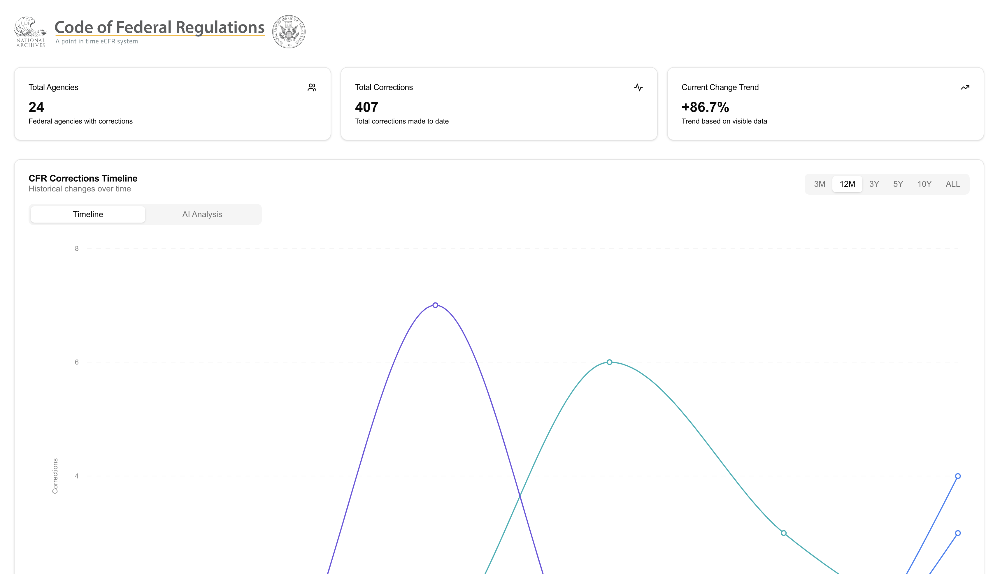
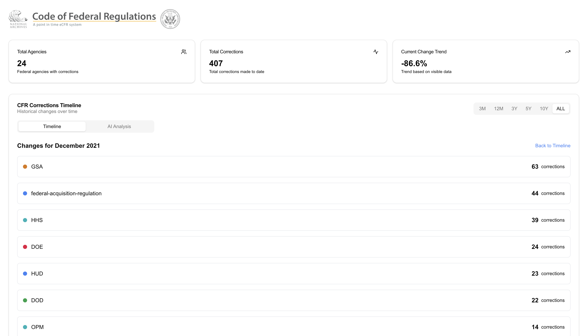

# Project Overview on the ECFR Dashboard

Refer to installation and setup instructions below.  Pay attention to the `api.ts` and the defined API url.  Change that to point to your local backend if you are cloning the backend version of this project.

## Project Structure

- `/app`:
Contains main rendered components with the page.tsx file.

  - `/app/components`:
Contains reusable components within the app folder we use for the page.tsx file.

  - Types are defined under the `types.ts` file.

- `/components`
Contains reusable components provided by shadcn/ui.

- `/lib`
Contains the API calls and utility functions for the project.

- `/reducers`
Contains the reducers for the project (state management).

- `/hooks`
Contains the custom hooks for the project which also have some reducers/actions for toast notifications.  But these are autogenerated from shadcn/ui.

## Future Work

- Add an LLM to the dashboard to generate a summary of the changes in the regulations and allow the user to further query the LLM for more information or context around the changes.
- Add a search bar to the dashboard to search for specific regulations.
- Add a filter to the dashboard to filter by agency.
- Add a filter to the dashboard to filter by title.
- Add a filter to the dashboard to filter by chapter.
- Add a filter to the dashboard to filter by subchapter.

## Demo




## Autogenerated from Shadcn UI/Next.js
This is a [Next.js](https://nextjs.org) project bootstrapped with [`create-next-app`](https://nextjs.org/docs/app/api-reference/cli/create-next-app).

## Getting Started

First, run the development server:

```bash
npm run dev
# or
yarn dev
# or
pnpm dev
# or
bun dev
```

Open [http://localhost:3000](http://localhost:3000) with your browser to see the result.

You can start editing the page by modifying `app/page.tsx`. The page auto-updates as you edit the file.

This project uses [`next/font`](https://nextjs.org/docs/app/building-your-application/optimizing/fonts) to automatically optimize and load [Geist](https://vercel.com/font), a new font family for Vercel.

## Learn More

To learn more about Next.js, take a look at the following resources:

- [Next.js Documentation](https://nextjs.org/docs) - learn about Next.js features and API.
- [Learn Next.js](https://nextjs.org/learn) - an interactive Next.js tutorial.

You can check out [the Next.js GitHub repository](https://github.com/vercel/next.js) - your feedback and contributions are welcome!

## Deploy on Vercel

The easiest way to deploy your Next.js app is to use the [Vercel Platform](https://vercel.com/new?utm_medium=default-template&filter=next.js&utm_source=create-next-app&utm_campaign=create-next-app-readme) from the creators of Next.js.

Check out our [Next.js deployment documentation](https://nextjs.org/docs/app/building-your-application/deploying) for more details.
